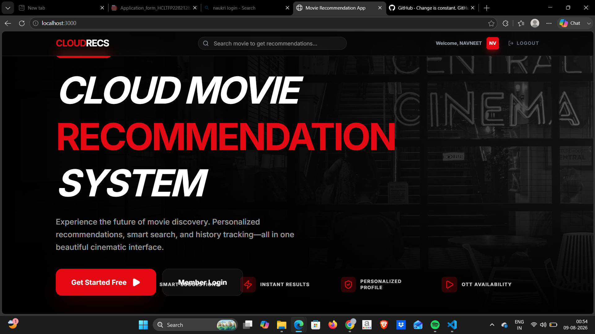

# 🎬 CloudRecs — Cloud Based Movie Recommendation System

A React (Vite + TypeScript) frontend and a Flask (Python) backend, using MongoDB Atlas for data and TMDB API for movie posters/details. Recommendations are generated with a content-based ML model (TF-IDF + cosine similarity).

This README explains everything step by step: how to run the app on your own computer, and how to deploy it live — frontend on **Vercel**, backend on **Render** — without CORS errors.

## Screenshots

**Landing page**



**Dashboard (after login)**


---

## 📁 Project Structure

```
cloudrecs/
├── backend/
│   ├── app.py               # Flask API (auth, recommend, history, etc.)
│   ├── run_prod.py          # alternate production entry point
│   ├── train_model.py       # builds the ML model (.pkl files) from the dataset
│   ├── requirements.txt
│   ├── Procfile              # start command for Render
│   ├── .env.example          # template for environment variables
│   ├── dataset/               # TMDB 5000 CSV files
│   └── model/                 # generated .pkl files (not committed to git)
├── frontend/
│   ├── src/
│   ├── package.json
│   ├── vercel.json            # fixes page-refresh 404s on Vercel
│   └── .env.example
└── screenshots/
```

---

## ⚠️ Read this first — Security Warning

The `.env` file you originally uploaded had a **real MongoDB password and TMDB key** written in plain text. If that file was ever pushed to GitHub or shared, please:

1. Go to MongoDB Atlas → Database Access → change that user's password right away.
2. Go to TMDB → Settings → API → regenerate your key if you're unsure.
3. Never commit a real `.env` file to git — a `.gitignore` is already set up to block this.

---

## ✅ Prerequisites

| Tool | Why you need it | Link |
|---|---|---|
| Node.js (v18+) | To run the frontend | https://nodejs.org |
| Python (3.10 or 3.11) | To run the backend | https://python.org |
| Git | To push your code to GitHub | https://git-scm.com |
| MongoDB Atlas (free) | Stores users and search history | https://cloud.mongodb.com |
| TMDB API key (free) | Fetches movie posters and details | https://www.themoviedb.org/settings/api |
| GitHub account | Both Vercel and Render deploy from a GitHub repo | https://github.com |
| Vercel account (free) | Hosts the frontend | https://vercel.com |
| Render account (free) | Hosts the backend | https://render.com |

---

## 1️⃣ Run the Backend Locally (Flask)

```bash
cd backend

# Create a virtual environment
python -m venv venv

# Activate it
# Windows:
venv\Scripts\activate
# Mac/Linux:
source venv/bin/activate

# Install dependencies
pip install -r requirements.txt
```

### Create the `.env` file

Copy `backend/.env.example` to `backend/.env` and fill in your own values:

```bash
# Windows
copy .env.example .env
# Mac/Linux
cp .env.example .env
```

`backend/.env` should look like this:

```
MONGO_URI=mongodb+srv://<username>:<password>@<cluster-url>/moviedb?retryWrites=true&w=majority&appName=Cluster0
JWT_SECRET=any-long-random-string
TMDB_API_KEY=your_tmdb_api_key
FRONTEND_URL=http://localhost:3000
PORT=5000
```

> Get `MONGO_URI` from MongoDB Atlas → Connect → "Connect your application". Replace `<password>` with your actual Atlas user password (URL-encode it if it has special characters).

### Generate the ML model

The `model/*.pkl` files are **not** included in this package (one of them is over 180MB, larger than GitHub's 100MB limit), so you need to build them once:

```bash
python train_model.py
```

This creates `movie_list.pkl`, `similarity.pkl`, `vectorizer.pkl`, and `scaler.pkl` inside `model/`. It takes about 1–2 minutes.

### Start the backend

```bash
python app.py
```

The backend runs at `http://127.0.0.1:5000`. Check it works: open `http://127.0.0.1:5000/health` in your browser.

---

## 2️⃣ Run the Frontend Locally (React + Vite)

Open a new terminal:

```bash
cd frontend
npm install
```

### Create the `.env` file

```bash
copy .env.example .env     # Windows
cp .env.example .env       # Mac/Linux
```

`frontend/.env`:

```
VITE_API_BASE_URL=http://127.0.0.1:5000
```

### Start the frontend

```bash
npm run dev
```

Open your browser: `http://localhost:3000`

Now register/login and search for a movie — if both the backend and MongoDB are running, everything should work.

---

## 3️⃣ Push the Code to GitHub

```bash
cd cloudrecs          # the project's root folder (containing backend/ and frontend/)
git init
git add .
git commit -m "Initial commit - CloudRecs movie recommendation app"
git branch -M main
git remote add origin https://github.com/<your-username>/<your-repo>.git
git push -u origin main
```

The `.gitignore` already excludes `venv/`, `node_modules/`, `.env`, and the large `model/*.pkl` files, so your repo stays small and safe.

---

## 4️⃣ Deploy the Backend → Render

1. Log in at https://render.com → **New +** → **Web Service**
2. Connect your GitHub repo
3. Use these settings:

| Setting | Value |
|---|---|
| **Name** | cloudrecs-backend (or any name) |
| **Root Directory** | `backend` |
| **Runtime** | Python 3 |
| **Build Command** | `pip install -r requirements.txt && python train_model.py` |
| **Start Command** | `gunicorn app:app --bind 0.0.0.0:$PORT` |
| **Instance Type** | Free |

> `python train_model.py` is in the build command because `model/*.pkl` is not committed to git — Render will build a fresh model on every deploy.

4. In the **Environment** tab, add these variables:

| Key | Value |
|---|---|
| `MONGO_URI` | your Atlas connection string |
| `JWT_SECRET` | any long random string |
| `TMDB_API_KEY` | your TMDB key |
| `FRONTEND_URL` | set to `http://localhost:3000` for now — you'll update it after deploying the frontend |
| `PYTHON_VERSION` | `3.11.0` (recommended) |

5. Click **Create Web Service**. The first build can take 3–5 minutes (because of model training). Once deployed, you'll get a URL like:
   `https://cloudrecs-backend.onrender.com`

6. Verify it: open `https://cloudrecs-backend.onrender.com/health` — you should see `{"status": "healthy", ...}`.

> **Note:** On Render's free tier, the service "sleeps" after 15 minutes of inactivity, so the first request after that can take 30–50 seconds. This is normal, not an error.

### Allow Render's traffic in MongoDB Atlas

Atlas → Network Access → **Add IP Address** → select **Allow Access from Anywhere** (`0.0.0.0/0`), since Render doesn't use a fixed IP. This is standard practice unless you set up VPC peering.

---

## 5️⃣ Deploy the Frontend → Vercel

1. Log in at https://vercel.com → **Add New** → **Project** → select your GitHub repo
2. In "Configure Project":

| Setting | Value |
|---|---|
| **Root Directory** | `frontend` |
| **Framework Preset** | Vite |
| **Build Command** | `npm run build` |
| **Output Directory** | `dist` |

3. Under **Environment Variables**, add:

| Key | Value |
|---|---|
| `VITE_API_BASE_URL` | your Render backend URL, e.g. `https://cloudrecs-backend.onrender.com` |

4. Click **Deploy**. In a few minutes you'll get a URL like:
   `https://cloudrecs.vercel.app`

`frontend/vercel.json` is already included and fixes React Router's SPA routing (otherwise refreshing a page like `/dashboard` would show a 404).

---

## 6️⃣ Fix CORS — Tell the Backend Your Frontend's URL

Once you have your Vercel URL, go back to **Render**:

1. Render → your backend service → **Environment**
2. Update `FRONTEND_URL`:
   ```
   FRONTEND_URL=http://localhost:3000,https://cloudrecs.vercel.app
   ```
   (you can list multiple URLs separated by commas — local and production)
3. Click **Save Changes** — Render will automatically redeploy/restart the service.

`app.py` only allows origins listed in `FRONTEND_URL`, so adding your Vercel domain here is required, otherwise the browser will block requests with a CORS error.

---

## ✅ Final Testing Checklist

- [ ] Open `https://<render-url>/health` and confirm the backend is live
- [ ] Open your Vercel URL and register/log in
- [ ] Search for a movie and check that recommendations appear
- [ ] Open the browser console (F12) and confirm there are no CORS/network errors
- [ ] Test the History and Personalized pages too

---

## 🛠️ Common Errors & Fixes

| Error | Reason | Fix |
|---|---|---|
| `Access-Control-Allow-Origin` CORS error | Your Vercel domain is missing/wrong in Render's `FRONTEND_URL` | Update `FRONTEND_URL` (step 6); don't add a trailing `/` after the URL |
| `Database temporarily unavailable` | MongoDB Atlas IP not whitelisted, or wrong `MONGO_URI` | Allow `0.0.0.0/0` in Atlas Network Access; double-check the URI in `.env` |
| Frontend shows `Network Error` / calls going to localhost | `VITE_API_BASE_URL` not set in Vercel | Add it in Vercel → Settings → Environment Variables, then **Redeploy** |
| Deploy fails with a 100MB file size error | `.pkl` model files got committed to git | Run `git rm -r --cached backend/model`, then commit — `.gitignore` already excludes them going forward |
| `/dashboard` shows 404 after refresh (Vercel) | Missing SPA routing config | `frontend/vercel.json` is included — confirm it's part of your deployed repo |
| Render build fails with `MemoryError` | Free tier build memory limit reached | Lower `max_features=12000` to `6000` in `backend/train_model.py` |
| First request takes 30–50 seconds | Render free tier cold start | Normal behavior — upgrade your plan, or ping the `/health` endpoint every 10 min with a free service like https://cron-job.org |

---

## 🔧 Useful Commands

```bash
# Backend
cd backend && venv\Scripts\activate && python app.py      # Windows local run
cd backend && source venv/bin/activate && python app.py   # Mac/Linux local run

# Frontend
cd frontend && npm run dev        # local dev server
cd frontend && npm run build      # production build

# Rebuild the ML model
cd backend && python train_model.py
```

---

## 📌 Tech Stack

- **Frontend:** React 19, TypeScript, Vite, TailwindCSS, React Router, Axios
- **Backend:** Flask, PyMongo, PyJWT, bcrypt, scikit-learn, pandas
- **Database:** MongoDB Atlas
- **ML:** TF-IDF + Cosine Similarity (content-based filtering) on the TMDB 5000 dataset
- **External API:** TMDB (posters, ratings, watch providers)
- **Hosting:** Vercel (frontend) + Render (backend)
